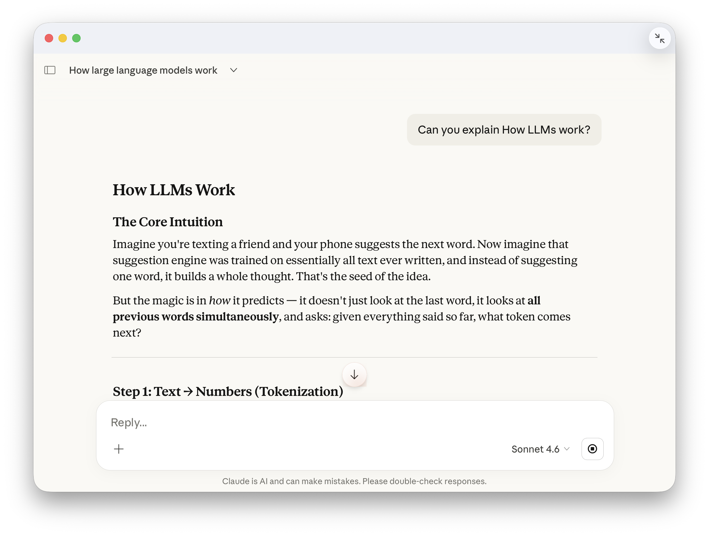
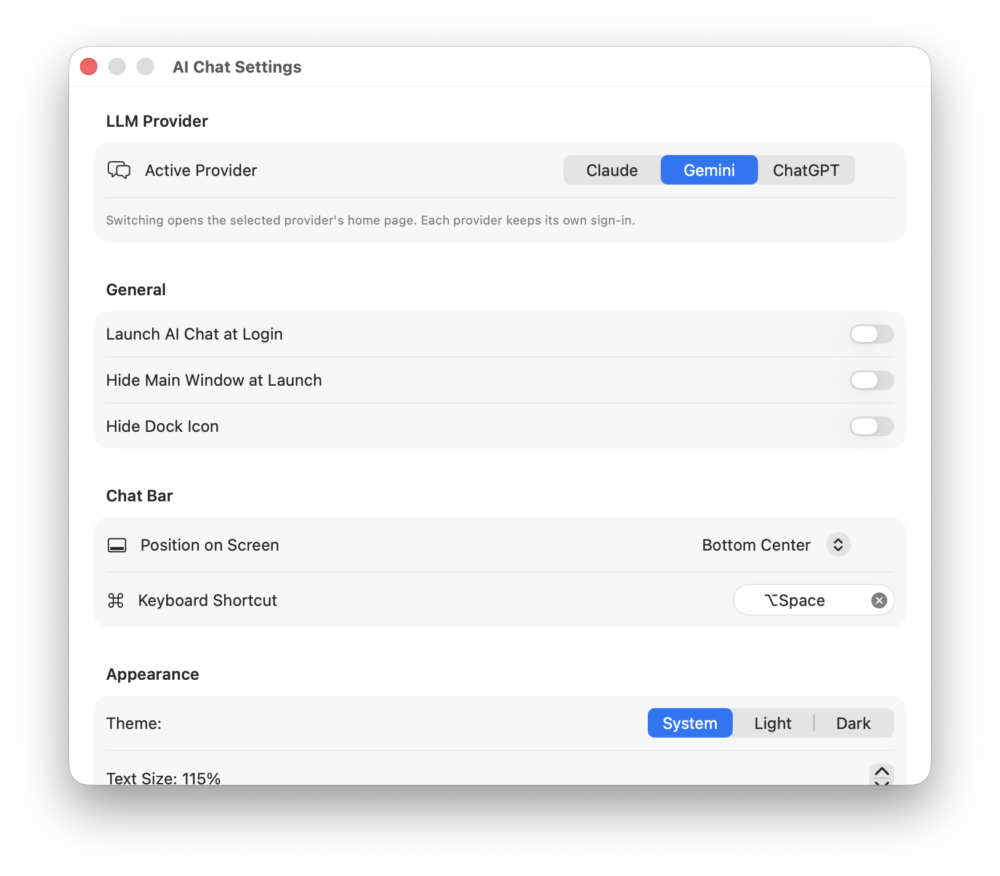
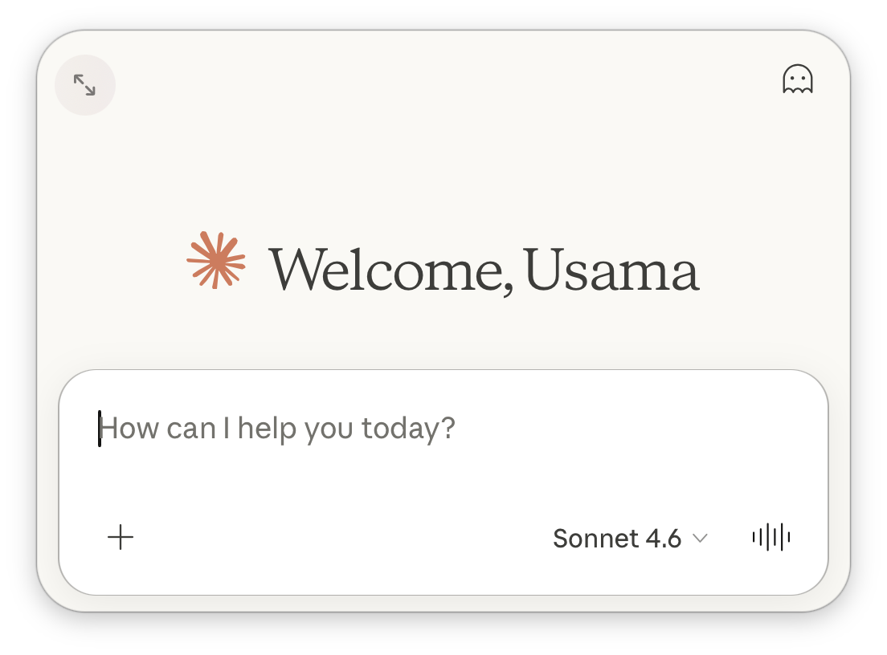

# Thinspace

**Big AI. Very little app.**

Thinspace is an unofficial macOS wrapper for the official
[Claude](https://claude.ai), [Gemini](https://gemini.google.com), and
[ChatGPT](https://chatgpt.com) web apps. It
keeps the familiar websites intact while providing one lightweight native app,
one floating Chat Bar, and one set of shortcuts.

Choose Claude, Gemini, or ChatGPT in Settings. Each provider keeps its own
persistent website session, so you can sign in to all three and switch without
signing in again.
To keep memory use low, Thinspace runs only the active provider's WebView; switching
providers opens that provider's home page.

Thinspace uses the providers' websites. It is not an API client and does not need
provider API keys.

A *thin space* is the narrowest deliberate gap in typesetting. That is the whole
idea: the smallest thing that can sit between you and three very large web apps.

## Screenshots

### Main window — Claude selected



### Provider switching



### Floating Chat Bar — Claude selected



## Features

- Claude, Gemini, and ChatGPT in one native macOS app
- Provider selection shared by the main window and floating Chat Bar
- Separate persistent login data for every provider
- Consistent native commands with provider-specific website integrations
- New Chat with `Command-N`
- Private Chat with `Command-Shift-N`, mapped to Claude Incognito Chat or
  Gemini/ChatGPT Temporary Chat
- Provider-aware toolbar actions, including Claude-only features where available
- Find, back, forward, reload, sidebar, zoom, and always-on-top controls
- Customizable native toolbar
- Floating Chat Bar with global shortcuts
- Light, dark, and system themes
- Shared zoom and user-agent settings
- Launch at login, optional hidden Dock icon, and optional hidden launch window
- Uploads, downloads, camera, and microphone support when a provider requests them
- Optional Text Capture: opens the Chat Bar with the text selected in another
  app already quoted, labelled with its app and document name
- Hardened runtime and outbound-network-only access

Because Thinspace integrates with live websites, a provider can change its page
structure or embedded-browser behavior at any time.

## Privacy and authentication

Each provider handles authentication on its own website. Thinspace does not
intercept your credentials, proxy conversations through an app-owned server, or
add analytics. Web content, cookies, cache, and sessions use macOS WebKit storage.

The Reset Website Data action clears the stored website data for all providers.

### Text Capture

Text Capture is off by default. While it is off, Thinspace observes nothing
outside its own windows, makes no Accessibility calls, and never shows the
system Accessibility prompt — turning the setting on is the only thing that can
trigger it.

With it on, opening the Chat Bar quotes the text you had selected in the app you
were using, labelled with the app and, where the app exposes one, the document
name or window title. The caret is left above the quotation, so you type your
instruction and send as usual:

```
Explain this            <- the caret starts here

--- Preview · quantization.pdf ---
[the text you had selected]
```

The quotation is ordinary composer text, so Enter, Command-Enter and the send
button all behave normally, and you can edit or delete it before sending.
Nothing is captured while the Chat Bar is closed and nothing is stored on disk.
Because the quotation becomes part of your message, it is sent to whichever
provider is active — review it before sending anything you would not paste in
yourself.

Reading a selection out of another application requires the macOS Accessibility
permission, which macOS does not grant to sandboxed apps. Thinspace therefore
ships without the App Sandbox as of 1.0. The hardened runtime is unchanged, and
web content still runs in WebKit's own sandboxed content processes, which the app
neither controls nor weakens — the untrusted surface stays confined either way.

## Requirements

- macOS 27.0 or later
- Apple silicon Mac

## Install

Download `Thinspace.dmg` from this repository's **Releases** page, or build from
source.

Releases are unsigned, so on first launch macOS will refuse to open the app.
Right-click it in Finder and choose **Open**, or run:

```bash
xattr -dr com.apple.quarantine "/Applications/Thinspace.app"
```

```bash
git clone https://github.com/0ssamaak0/ai-chat-mac.git
cd ai-chat-mac
open AIChat.xcodeproj
```

Select the `AIChat` scheme in Xcode and run it on **My Mac**. The Xcode project,
scheme and target are still named `AIChat` internally; the built product is
`Thinspace.app`. For an unsigned command-line release build and DMG
instructions, see [build_instructions.md](build_instructions.md).

Run the provider architecture tests from the command line:

```bash
xcodebuild test \
  -project AIChat.xcodeproj \
  -scheme AIChat \
  -destination 'platform=macOS,arch=arm64' \
  -only-testing:AIChatTests \
  CODE_SIGNING_ALLOWED=NO
```

The project targets macOS 27 and arm64. Its only Swift package dependency is
[KeyboardShortcuts](https://github.com/sindresorhus/KeyboardShortcuts), pinned to
version 3.0.1.

## Unofficial app and trademarks

Thinspace is not affiliated with, endorsed by, or sponsored by Anthropic, Google,
or OpenAI. Claude is a trademark of Anthropic PBC. Gemini and Google are
trademarks of Google LLC. ChatGPT and OpenAI are trademarks of OpenAI. All
provider names, marks, website content, and services belong to their respective
owners.

## License and attribution

This repository is distributed under the
[Creative Commons Attribution-NonCommercial 4.0 International License](LICENSE).
The license permits sharing and adaptation with attribution for noncommercial
purposes; it does not permit commercial use.

Thinspace is an adapted work based on
[Gemini Desktop](https://github.com/alexcding/gemini-desktop-mac) by alexcding.
The original copyright and license notice is preserved in [LICENSE](LICENSE).
Changes were made to add Claude and ChatGPT support and combine all three web
apps into this provider-switching app.
